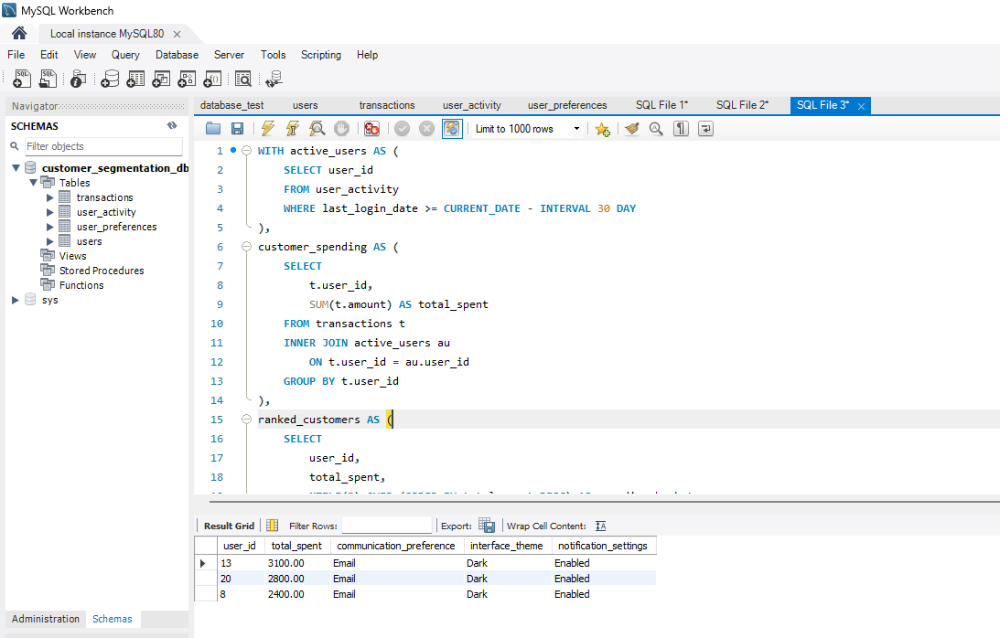

# Lab: Generative AI for Data Science

In this lab, we are work on three separate real-world scenarios. Each scenario will have a task to complete, along with a discussion component highlighting differences in generated code based on the individual prompts used. The focus is on learning how different prompting strategies can lead to various generated solutions.

Recall the prompt engineering process:

1. Problem Definition & Scope
2. Context Setting & Framework
3. Initial Prompt Construction
4. Refinement & Testing
5. Iteration & Optimization

As well as the more general process for generating code:

1. Requirement Analysis & Planning
2. Development Strategy
3. Iterative Code Generation
4. Testing & Validation
5. Refinement & Optimization

